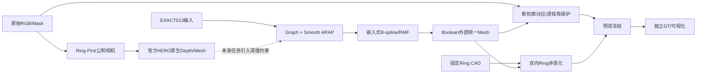

# 数据流与冻结边界

```mermaid
flowchart LR
 RGB[原始RGB/Mask] --> RF[Ring-First公制相机]
 RF --> HERO[官方HERO原生Depth/Mesh]
 I[EXACT013输入] --> G[Graph + Smooth ARAP]
 G --> S[嵌入式B-spline/RMF]
 S --> U[Boolean外部统一Mesh]
 RGB --> P[新轮廓对应/逐视角保护]
 U --> P
 CAD[固定Ring CAD] --> R[双向Ring非恶化]
 U --> R
 P --> F[预测冻结]
 R --> F
 F --> E[独立GT/可视化]
 HERO -.未来任务引入深度约束.-> G
```

本维护任务不执行虚线的新科学耦合；HERO独立固定样本推理、主体checkpoint链分别重放。FIT/HOLDOUT、相机及原始深度不改；GT不参与新参数选择。
